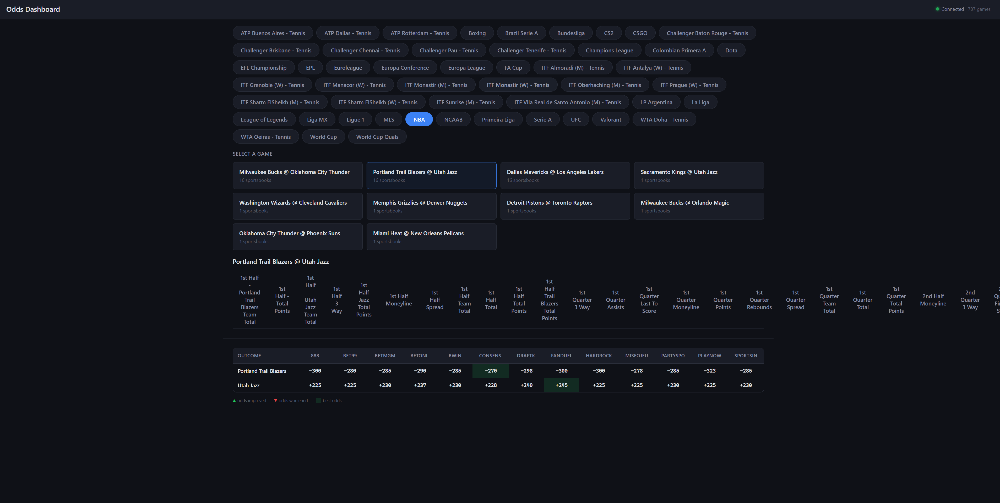

# Odds Dashboard

Real-time sports odds comparison dashboard. Aggregates odds from multiple sportsbooks via the [BoltOdds](https://boltodds.com) API and displays them in a live-updating grid.



## Tech Stack

- **Backend**: Python 3.10+ / FastAPI / uvicorn / websockets
- **Frontend**: TypeScript / Svelte 5 / SvelteKit 2 / Vite 5

## Getting Started

### Backend

```bash
cd backend
pip install -r requirements.txt
```

Create a `.env` file in `backend/` with your API key:

```
BOLTODDS_API_KEY=<your-key>
```

Start the server:

```bash
uvicorn main:app --reload --host 0.0.0.0 --port 8000
```

### Frontend

```bash
cd frontend
npm install
npm run dev
```

The app will be available at `http://localhost:5173`. The Vite dev server proxies API and WebSocket requests to the backend.

## How It Works

The backend maintains a single upstream WebSocket connection to BoltOdds and fans out filtered updates to browser clients. This keeps the API key server-side and reduces upstream connections.

Clients receive a full snapshot on subscribe, then incremental updates. The frontend uses Svelte reactive stores to keep the UI in sync with incoming data, including odds movement detection and best-price highlighting.
